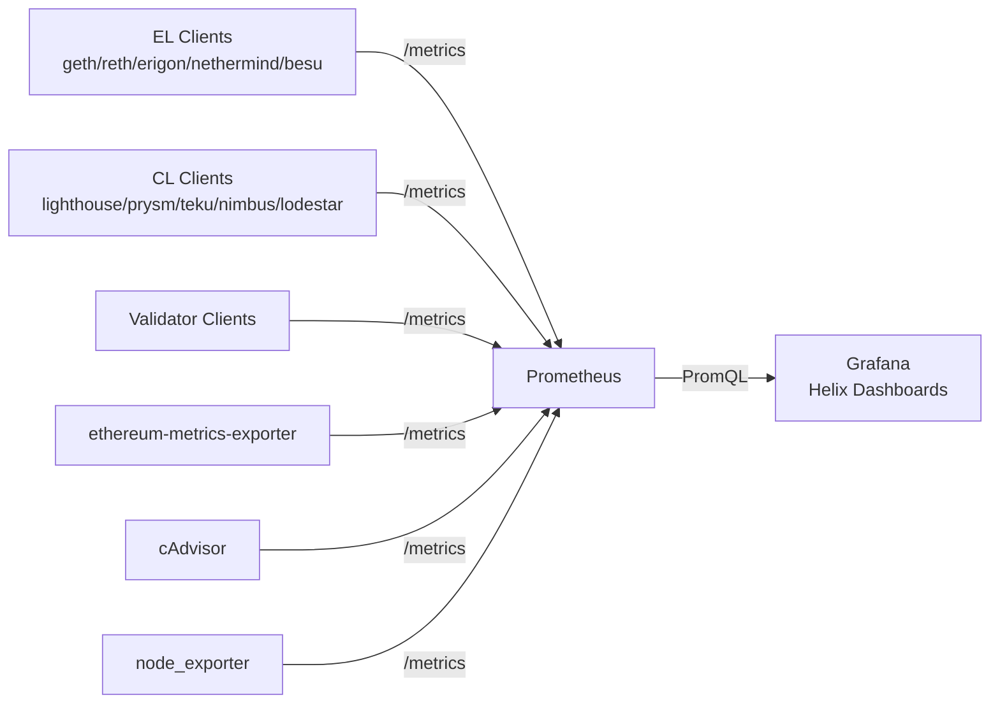

# Helix Documentation

Helix is an open-source collection of Grafana dashboards, Prometheus scrape configs, recording rules, and alert rules for Ethereum devnets built with [ethpandaops/ethereum-package](https://github.com/ethpandaops/ethereum-package) on Kurtosis.

## Why Helix?

Ethereum devnets can include dozens of execution clients, consensus clients, validator clients, exporters, and test workloads. When something goes wrong, operators need to know *where* the problem is — not just that the devnet is unhealthy.

Helix gives you a layered observability stack:

| Layer | Sources | Questions Answered |
|-------|---------|-------------------|
| **API view** | ethereum-metrics-exporter | Is the EL synced? What's the head block? Are peers connected? |
| **Client internals** | Native client metrics | Is the DB cache cold? Is the engine API slow? Are goroutines piling up? |
| **Infrastructure** | cAdvisor, node_exporter | Is the container OOMing? Is the disk about to fill? Is the clock drifted? |

## Architecture



## Dashboards

| Dashboard | Purpose |
|-----------|---------|
| **Overview** | Single pane of glass — EL sync, CL head/finality, peer counts, host resources |
| **Geth / Reth / Erigon / Nethermind / Besu** | Per-client EL deep-dive |
| **Lighthouse / Prysm / Teku / Nimbus / Lodestar** | Per-client CL deep-dive |
| **Validator Overview** | Duty performance, missed attestations, balance change |
| **Host Resources** | Container CPU/memory/disk/network, NTP clock offset |
| **Cross-Client API** | Sync comparison table, head spread, peer counts |

## Repository Structure

```
helix/
├── dashboards/       # Grafana dashboard JSON files
├── prometheus/
│   ├── prometheus.yml
│   └── rules/        # Recording and alert rules
├── provisioning/     # Grafana auto-provisioning YAML
├── fixtures/         # Sample .prom files for CI
├── docs/             # This documentation
├── website/          # Public landing page
└── scripts/          # CI validation scripts
```

## Getting Started

See the [Quick Start guide](quickstart.md) to spin up a devnet with Helix dashboards in minutes.
